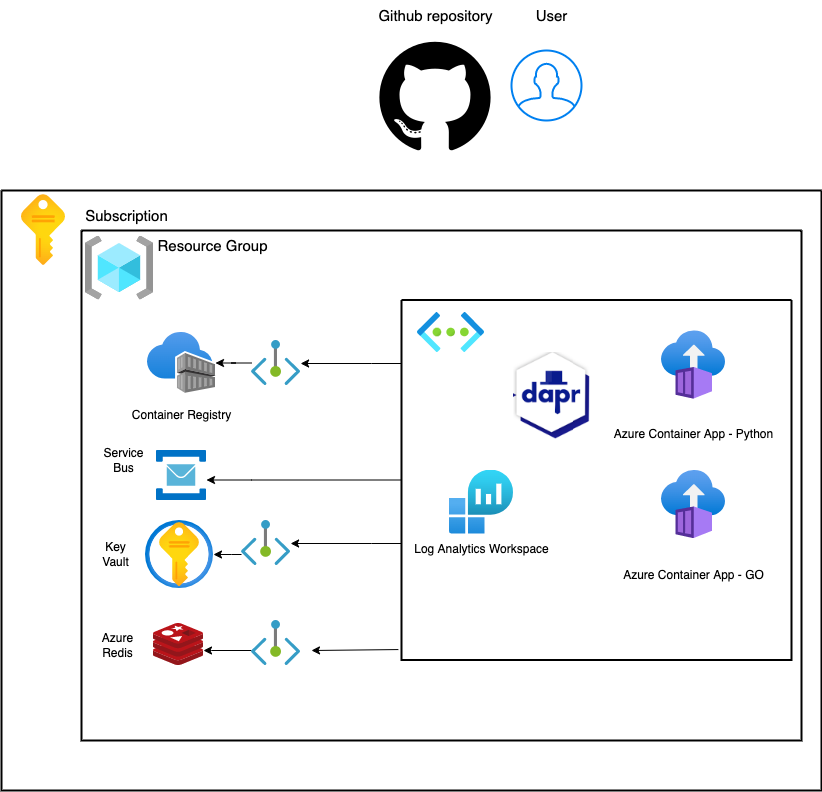
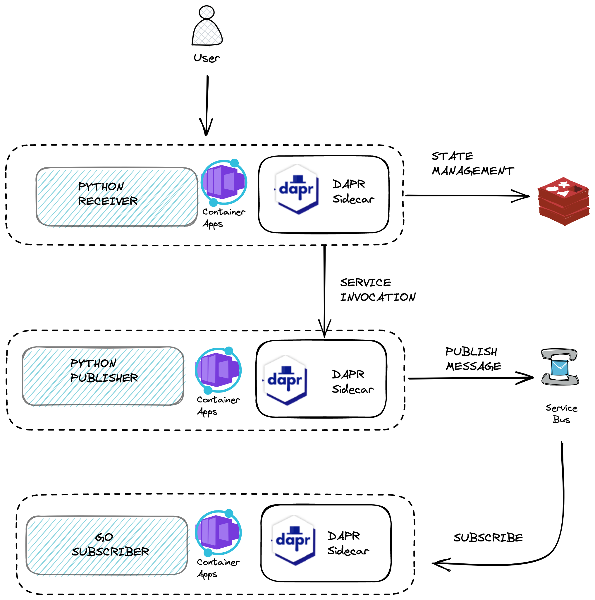

Table of Contents
=================

- [Infrastructure](#infrastructure)
  - [Infrastructure diagram](#infrastructure-diagram)
- [Application](#application)
  - [Application diagram](#application-diagram)
  - [Application endpoints](#application-endpoints)
    - [Python receiver](#python-receiver)
    - [Python publisher](#python-publisher)
    - [GO subscriber](#go-subscriber)
- [Dapr](#dapr)
  - [Overview](#overview)
  - [Service invocation](#service-invocation)
# Infrastructure

## Infrastructure diagram



# Application
## Application diagram



## Application endpoints

### Python receiver

FastApi app to receive messages from users about planets.

* `/planets` (POST)

Endpoint saves state to Azure Redis using http protocol:

```python
async with AsyncClient() as client:
    response = await client.post(
        url=f'http://localhost:3500/v1.0/state/{DAPR_STORE_NAME}',
        json=data
    )
```

And makes service-to-service invocation to trigger Python publisher app:
```python
async with AsyncClient() as client:
    publisher_response = await client.post(
        url='http://localhost:3500/sdk/publisher',
        headers={'dapr-app-id': 'python-publisher', 'content-type': 'application/json'},
        json=data
    )
```

* `/planets/{planet_id}` (GET)

Endpoint gets state from Azure Redis using http protocol:

```python
async with AsyncClient() as client:
    response = await client.get(
        url=f'http://localhost:3500/v1.0/state/{DAPR_STORE_NAME}/{planet_id}'
    )
```

*  `/sdk/planets` (POST)

Endpoint saves state to Azure Redis using grpc protocol:

```python
with DaprClient() as client:
    response = client.save_state(
        store_name=DAPR_STORE_NAME,
        key=data.get('key'),
        value=str(data.get('value'))
    )
```

* `/sdk/planets/{planet_id}` (GET)

Endpoint gets state from Azure Redis using grpc protocol:

```python
with DaprClient() as client:
    response = client.get_state(
        store_name=DAPR_STORE_NAME,
        key=planet_id
    )
```

### Python publisher

* `/http/publisher` (POST)

Endpoint to trigger background task to post message to Azure Service Bus using http:

```python
async with AsyncClient() as client:
    await client.post(
        url=f'http://localhost:3500/v1.0/publish/{DAPR_PUBSUB_NAME}/{DAPR_TOPIC}',
        json=planet_data
    )
```

* `/sdk/publisher` (POST)

Endpoint to trigger background task to post message to Azure Service Bus using grpc:

```python
with DaprClient() as client:
    client.publish_event(
        pubsub_name=DAPR_PUBSUB_NAME,
        topic_name=DAPR_TOPIC,
        data=json.dumps(planet_data).encode('utf-8'),
        data_content_type='application/json'
    )
```

### GO subscriber

* `/dapr/subscribe`

Endpoint to register Dapr pub/sub subscription. Dapr creates subscription in Azure Service Bus to provided topic.

* `/planets`

Endpoint where service receives message.

# Dapr

## Overview

* [Docs](https://docs.dapr.io/concepts/overview/)


## Service invocation

* [Docs](https://docs.dapr.io/developing-applications/building-blocks/service-invocation/service-invocation-overview/)

## State management

* [Docs](https://docs.dapr.io/developing-applications/building-blocks/state-management/state-management-overview/)

## Publish-Subscribe

* [Docs](https://docs.dapr.io/developing-applications/building-blocks/pubsub/pubsub-overview/)